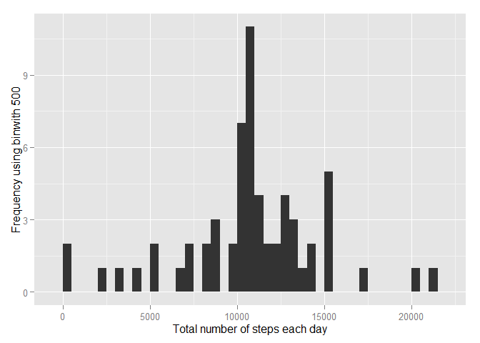

# Reproducible Research: Peer Assessment 1
Murat Adivar  
November 13, 2015  

## Initial settings/packages

```r
library(ggplot2)
library(scales)
library(Hmisc)
```

## Loading and preprocessing the data
##### 1. Load the data (i.e. read.csv())

```r
if(!file.exists('activity.csv')){
    unzip('activity.zip')
}
My_Data <- read.csv('activity.csv')
```
##### 2. Process/transform the data (if necessary) into a format suitable for your analysis

```r
#My_Data$interval <- strptime(gsub("([0-9]{1,2})([0-9]{2})", "\\1:\\2", My_Data$interval), format='%H:%M')
```

-----

## What is mean total number of steps taken per day?

```r
Steps_Each_Day <- tapply(My_Data$steps, My_Data$date, sum, na.rm=TRUE)
```

##### 1. Make a histogram of the total number of steps taken each day

```r
qplot(Steps_Each_Day, xlab='Total steps per day', ylab='Frequency using binwith 500', binwidth=500)
```

 

##### 2. Calculate and report the mean and median total number of steps taken per day

```r
Steps_Each_Day_Mean <- mean(Steps_Each_Day)
Steps_Each_Day_Median <- median(Steps_Each_Day)
```
* Mean: 9354.2295082
* Median:  10395

-----

## What is the average daily activity pattern?

```r
Avg_Steps_Per_Time_Block <- aggregate(x=list(meanSteps=My_Data$steps), by=list(interval=My_Data$interval), FUN=mean, na.rm=TRUE)
```

##### 1. Make a time series plot

```r
ggplot(data=Avg_Steps_Per_Time_Block, aes(x=interval, y=meanSteps)) +
    geom_line() +
    xlab("5-minute interval") +
    ylab("average number of steps taken") 
```

 

##### 2. Which 5-minute interval, on average across all the days in the dataset, contains the maximum number of steps?

```r
mostSteps <- which.max(Avg_Steps_Per_Time_Block$meanSteps)
timeMostSteps <-  gsub("([0-9]{1,2})([0-9]{2})", "\\1:\\2", Avg_Steps_Per_Time_Block[mostSteps,'interval'])
```

* Most Steps at: 8:35

----

## Imputing missing values
##### 1. Calculate and report the total number of missing values in the dataset 

```r
NoNA <- length(which(is.na(My_Data$steps)))
```

* Number of missing values: 2304

##### 2. Devise a strategy for filling in all of the missing values in the dataset.
##### 3. Create a new dataset that is equal to the original dataset but with the missing data filled in.

```r
My_Data_Imputed <- My_Data
My_Data_Imputed$steps <- impute(My_Data$steps, fun=mean)
```


##### 4. Make a histogram of the total number of steps taken each day and Calculate and report the mean and median total number of steps taken per day. 

```r
Steps_Each_Day_Imputed <- tapply(My_Data_Imputed$steps, My_Data_Imputed$date, sum)
qplot(Steps_Each_Day_Imputed, xlab='Total number of steps each day', ylab='Frequency using binwith 500', binwidth=500)
```

 


```r
Steps_Each_Day_Mean_Imputed <- mean(Steps_Each_Day_Imputed)
Steps_Each_Day_MedianImputed <- median(Steps_Each_Day_Imputed)
```
* Mean (Imputed): 1.0766189\times 10^{4}
* Median (Imputed):  1.0766189\times 10^{4}


----

## Are there differences in activity patterns between weekdays and weekends?
##### 1. Create a new factor variable in the dataset with two levels ??? ???weekday??? and ???weekend??? indicating whether a given date is a weekday or weekend day.


```r
My_Data_Imputed$dateType <-  ifelse(as.POSIXlt(My_Data_Imputed$date)$wday %in% c(0,6), 'weekend', 'weekday')
```

##### 2. Make a panel plot containing a time series plot


```r
Avg_My_Data_Imputed <- aggregate(steps ~ interval + dateType, data=My_Data_Imputed, mean)
ggplot(Avg_My_Data_Imputed, aes(interval, steps)) + 
    geom_line() + 
    facet_grid(dateType ~ .) +
    xlab("5-minute interval") + 
    ylab("avarage number of steps")
```

 

